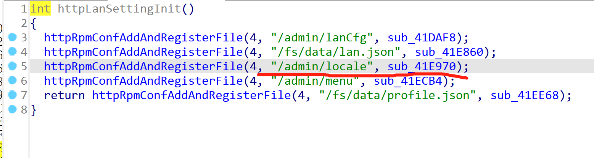
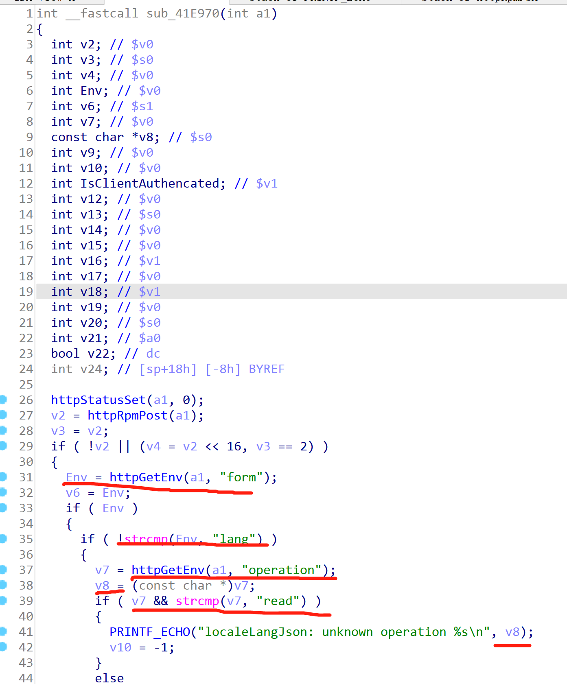
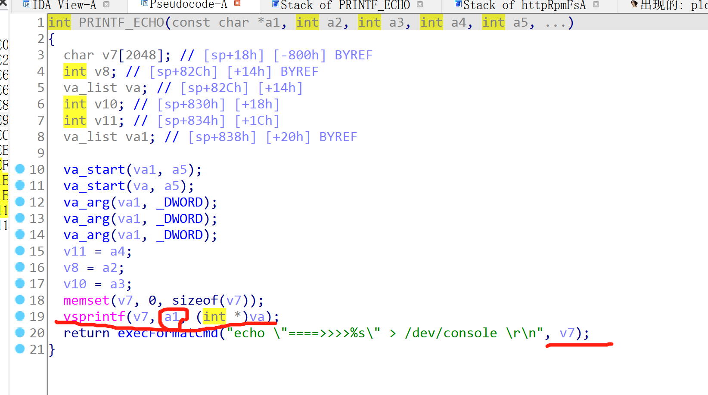
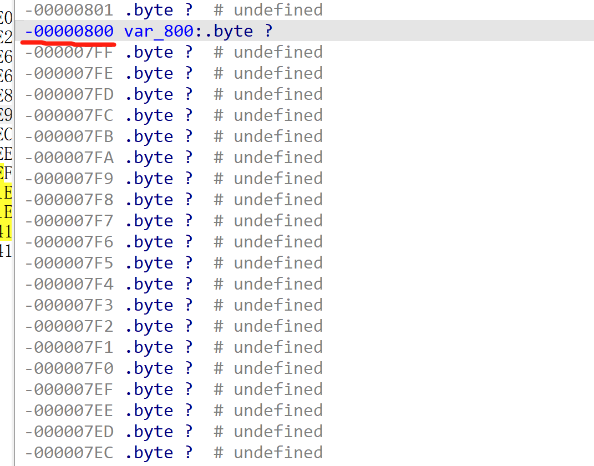
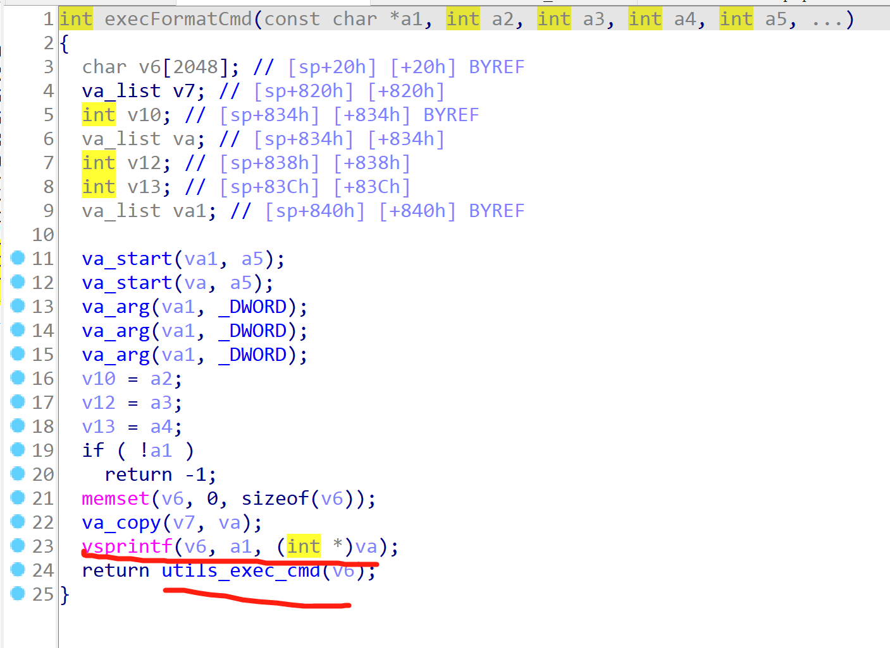
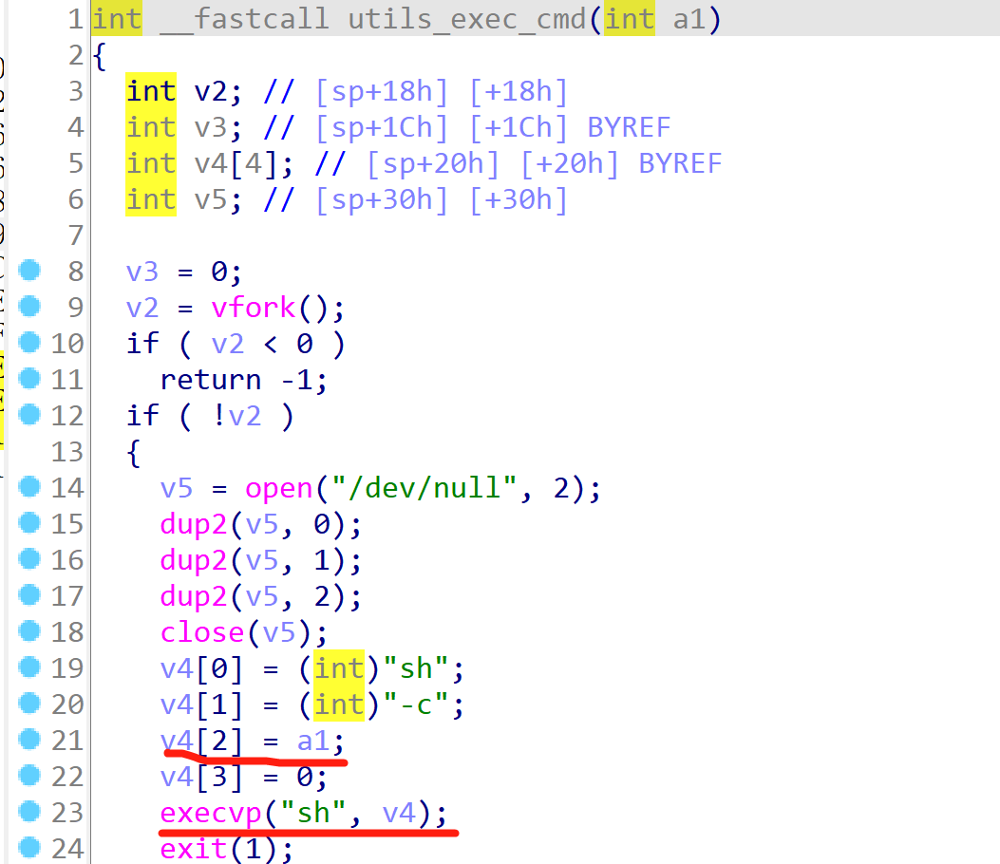

# Vul3 TP-Link WPA7510
Vulnerability description: httpd handles the sub_41E970 function from /admin/locale without checking the operation field passed into the PRINTF_ECHO function and the excFormatCmd function, resulting in a stack overflow and arbitrary command execution.

The value of v7 is controlled via form=lang. v7 receives the value of the operation field from the front end and assigns it to v8. v7 is not empty and is not read then v8 is spliced into the PEINTF_ECHO function

This function stitches a1 directly to v7 via the vsprintf function and passes v7 to excFormatCmd

If the stack length is 0x800, a stack overflow can be caused by the length of the option field being greater than 2052.

The stack overflow is also caused at excFormatCmd

utils_exec_cmd will execute any command

poc:

