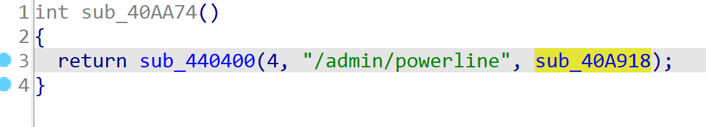
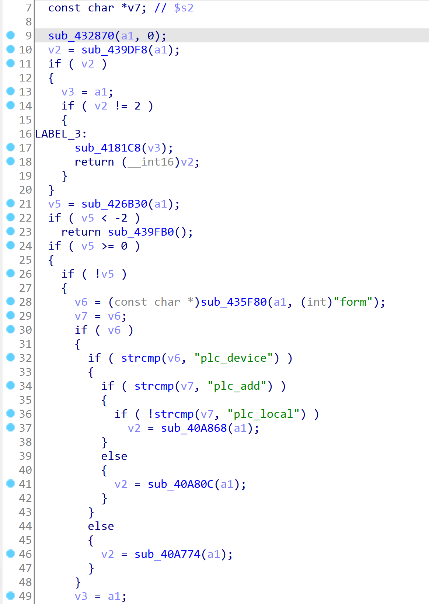
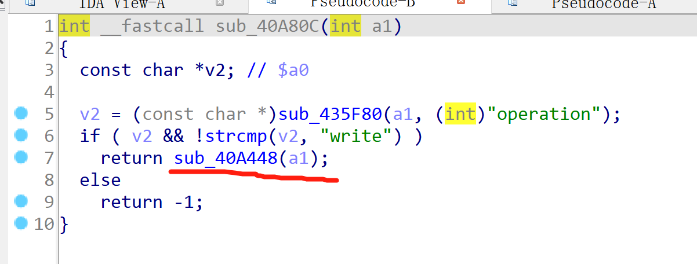
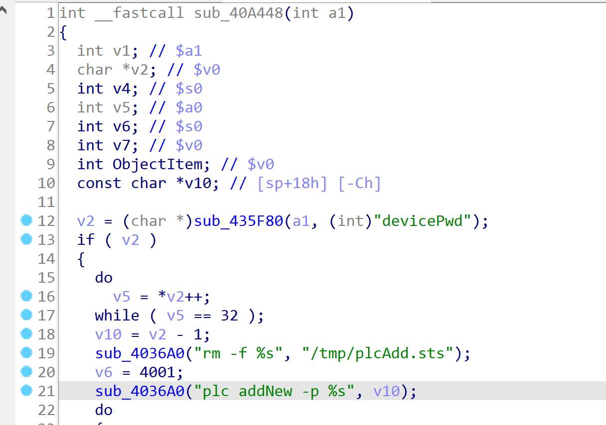
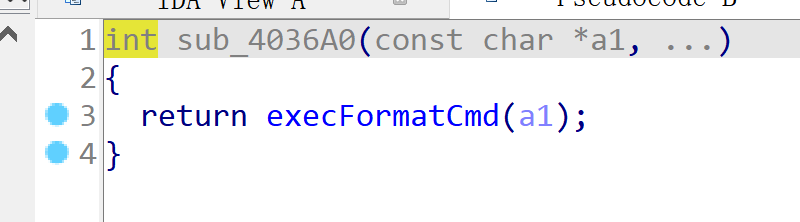
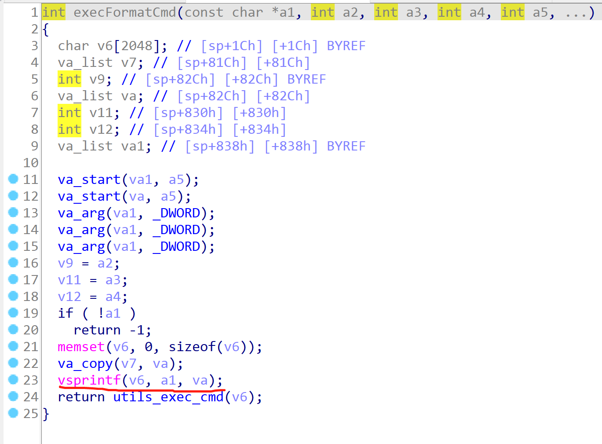
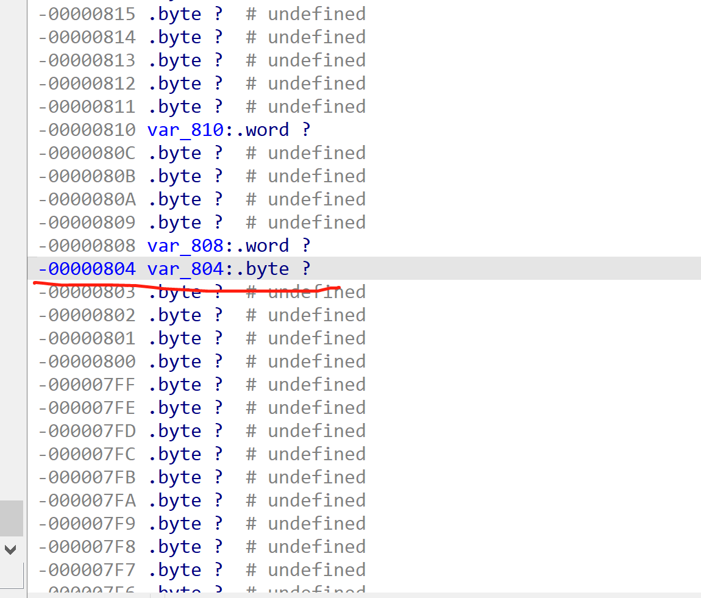
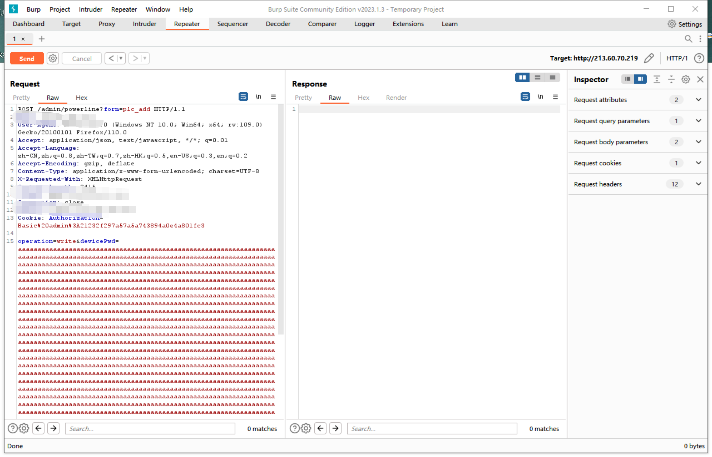
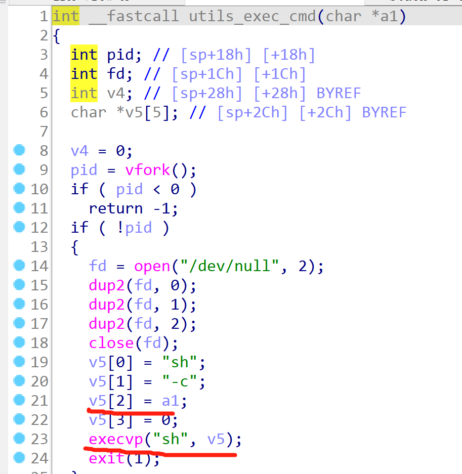
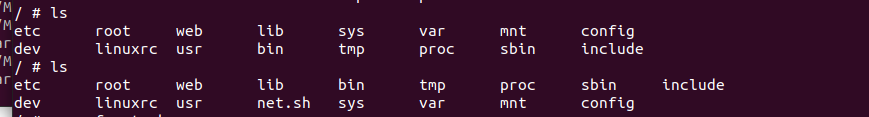

# Vul2 TP-Link WPA8630P
Vulnerability introduction:
Process the sub of admin/powerline in the httpd file_ There is a command injection vulnerability in the 40A918 function (stack overflow can also be constructed). 
The devicePwd parameter in the function sub_ 40A80C controlled by plc_add is not filtered,but is directly executed by vsprintf splicing, resulting in command injection and stack overflow attack.
Version: TL-WPA8630 KIT (US)_ V2_ Version 171011, and other versions of WPA, WR, WA and other power cat and repeater equipment.

Vulnerability static analysis

When processing web requests from/admin/powerline, run sub_ 40A918 function

Accept the form field from the front end and judge when the form field value is plc_ device execute sub_40A80C

Use this function to process the operation field, and execute sub when the field value is remove sub_40A448

This function processes the value from the key field and directly splices the value into the sub_ 4036A0 function

This function executes system commands

Directly splice the value of a1 to v6 through the insecure vsprintf function

The stack length of v6 is 0x804=2052, stack overflow will occur when the length of a1 exceeds 2052

Directly splice the value of a1 to v6 through the insecure vsprintf function, and pass v6 into the function utils_ exec_ cmd

This function directly assigns a1 to v5, and executes commands through execvp, resulting in arbitrary command execution

getshell
